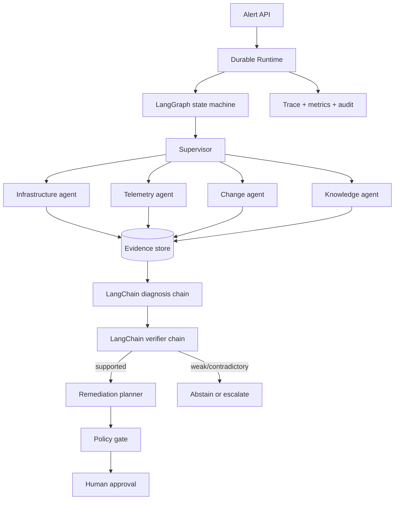

# Architecture

Sentinel places a deterministic, auditable control plane around probabilistic or learned components.



## Boundaries

- `api/` exposes incident, evidence, trace, approval, simulator, and benchmark resources.
- `runtime/` owns state transitions, budgets, retries, checkpointing, context, tool policy, and tracing.
- `agents/` contains the supervisor and evidence-specialized roles.
- `mcp/` provides typed, MCP-shaped Kubernetes, observability, Git, and incident tools.
- `ml/` trains and serves anomaly, log-intelligence, and reranking components.
- `persistence/` is the only module allowed to mutate durable incident state.
- `safety/` validates proposed actions before and after model generation.

Every claim in a supported diagnosis references stable evidence IDs. Agent-generated text is data, never a
host command. All writes are classified before execution; destructive actions cannot be approved.

## Orchestration and model path

`SupervisorAgent` compiles a real LangGraph `StateGraph` named `sentinel-investigation`. Its nodes are
`initialize`, `collect_evidence`, `diagnose`, `verify`, `remediate`, and `abstain`. Verification uses a
conditional edge, so unsupported diagnoses cannot reach remediation. Infrastructure, telemetry,
change-analysis, and retrieval specialists execute concurrently inside the evidence-collection stage.

After every graph node, Sentinel writes its validated `RuntimeState` to the checksummed checkpoint store and
records `graph_stage` plus the traversed path. An interrupted execution re-enters the compiled graph at the
node following the last durable stage instead of replaying the full investigation.

Diagnosis and verification use LangChain Expression Language pipelines:

```text
ChatPromptTemplate -> RoutedChatModel -> PydanticOutputParser -> policy/provenance validation
```

The default `RoutedChatModel` delegates to Sentinel's deterministic provider for reproducible offline tests.
The same `ModelRouter` can initialize any supported LangChain chat provider, including Google Vertex AI and
OpenAI integrations installed through the `models` extra. Provider failures route to the explicit,
auditable deterministic fallback. Model identity, prompt version, input/output tokens, cost, duration, and
retry count are stored for every call.

All investigation tools cross a LangChain `StructuredTool` boundary before reaching `ToolRegistry`. Pydantic
input schemas, Sentinel authorization, call budgets, persistence, evidence provenance, and the destructive
action deny policy remain authoritative; LangChain never bypasses those controls.

`ToolProviderConfig` selects one of two provider sets behind those contracts. Simulator providers return
deterministic scenario observations for offline tests. Live providers invoke namespace-scoped `kubectl`,
Prometheus and Tempo HTTP APIs, a configured local Git repository and optional GitHub metadata, and the
durable incident store. Live telemetry never supplements provider evidence with simulator snapshots.

The React operator console talks to a same-origin server route that holds the API bearer token outside the
browser bundle. It reads incidents, checkpoints, budgets, tasks, evidence, tool traces, remediations, and
evaluation manifests from FastAPI. Approval issuance and decisions call the same control-plane endpoints as
other clients; no browser-only state can mark a remediation approved. Approved patch proposals are
revalidated and materialized through the low-risk Git tool, while rollback proposals remain explicitly
manual until an operator-controlled deployment adapter exists.
