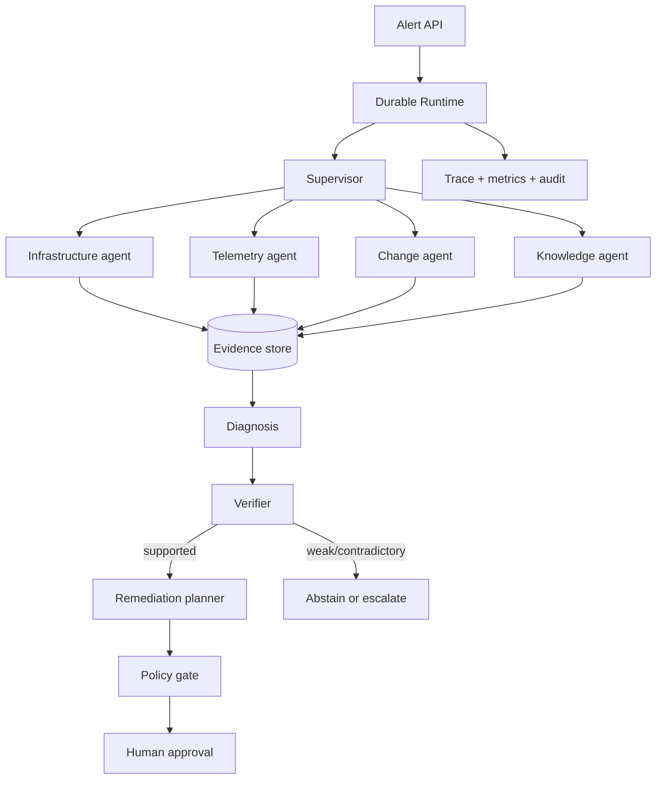

# Architecture

Sentinel places a deterministic control plane around probabilistic or learned components.

## Boundaries

- `api/` exposes incident, evidence, trace, approval, simulator, and benchmark resources.
- `runtime/` owns state transitions, budgets, retries, checkpointing, context, tool policy, and tracing.
- `agents/` contains the supervisor and evidence-specialized roles.
- `mcp/` provides typed, MCP-shaped Kubernetes, observability, Git, and incident tools.
- `ml/` trains and serves anomaly, log-intelligence, and reranking components.
- `persistence/` is the only module allowed to mutate durable incident state.
- `safety/` validates proposed actions before and after model generation.

Every claim in a supported diagnosis references stable evidence IDs. Agent-generated text is data, never a
host command. All writes are classified before execution; destructive actions cannot be approved.

